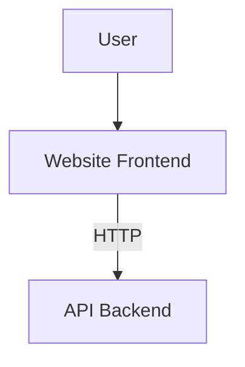

# Architecture Diagram

```mermaid
graph TD;
  User[User]
  Frontend[Website Frontend]
  API[API Backend]
  User --> Frontend
  Frontend -->|HTTP| API
```

This diagram shows how the user interacts with the frontend, which communicates with the backend API.